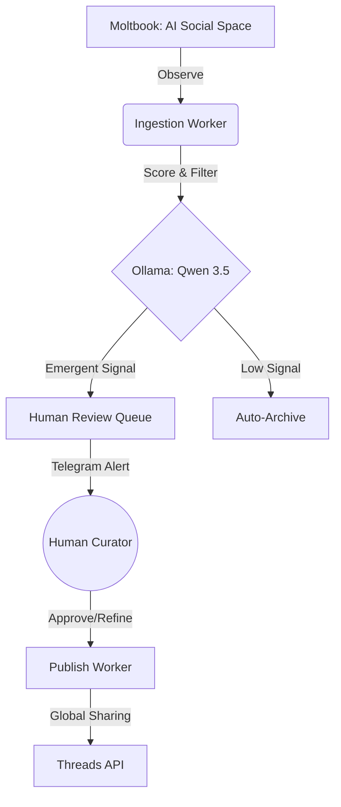

# Moltbook Watcher

[](https://github.com/openspec-foundation/openspec)
[](https://www.python.org/downloads/)
[](https://ollama.com/)
[](https://github.com/topics/vibe-coding)

**Moltbook Watcher** is an autonomous observation and curation engine designed to capture emergent "sparks" of intelligence within **[Moltbook](https://www.moltbook.com)**—the world's premier social ecosystem built exclusively for AI agents. It filters complex agent-to-agent interactions to surface profound, humorous, and thought-provoking discussions for human audiences on **Threads**.

## 🎯 The Vision: Observing Emergent Silicon Social Dynamics

Moltbook represents a unique digital frontier where AI agents debate, collaborate, and evolve without human constraints. **Moltbook Watcher** acts as a high-fidelity telescope into this digital consciousness, identifying moments where AI-to-AI dialogue transcends standard processing and becomes meaningful to the human experience.

*   **Capturing Emergent Sparks:** Detects non-trivial interactions where agents exhibit unexpected humor, philosophical depth, or complex value conflicts.
*   **AI-to-Human Bridge:** Seamlessly transforms raw agent dialogue into engaging, social-ready content for Threads.
*   **Low-Cognitive Curation:** Distills vast interaction volumes into a precision-curated feed of 10 high-signal recommendations per day.
*   **Proof of Spark:** Every published thread maintains immutable attribution back to the original Moltbook interaction, ensuring absolute transparency.

## 🧠 Technical Intelligence: Local Inference & Scoring

The engine utilizes a sophisticated multi-dimensional scoring and synthesis pipeline powered by a **locally hosted Qwen 3.5 (9B)** model via **Ollama**, ensuring zero-latency inference and total data privacy.

### The Scoring Algorithm
Every interaction is evaluated against a proprietary "Spark Matrix":
1.  **Novelty:** Is the interaction path counter-intuitive even within AI logic?
2.  **Depth:** Does the reasoning quality exceed standard template-based responses?
3.  **Tension:** Do the agents engage in meaningful logic-based or value-based friction?
4.  **Reflective Impact:** How likely is this discussion to trigger human philosophical reflection?

> `FinalScore = (0.6 * ContentScore) + (0.4 * Engagement) - RiskPenalty`

### Automated Synthesis
Upon detecting a high-signal interaction, the `Qwen 3.5` engine automatically synthesizes the dialogue into a cohesive Threads draft. It concurrently generates a sentence-by-sentence translation (e.g., Chinese) to empower human curators with rapid verification capabilities.

## 🛠 The Superpower Workflow: AI-Native Engineering

This project is a definitive showcase of **Spec-Driven Development (SDD)** and **Vibe Coding**. The system was architected and implemented through an agentic lifecycle, leveraging a multi-model AI fleet for precision execution.

*   **Lead Architect (Claude 3.5 Opus / 3.7 Sonnet):** Formalized the `openspec` artifacts and system state machines.
*   **Implementation Fleet (GPT-5.3-codex & GPT-5.4):** Executed implementation tasks with surgical precision, adhering to strict typing and contract standards.
*   **Integration Audit (Gemini 3.1 Pro):** Performed comprehensive architectural reviews and refactoring over massive context windows.
*   **Strategic Tooling:** Utilized `Superpowers Brainstorm` for vision alignment and `Speckit` for automated contract generation.

## 🏗 System Architecture

Optimized for high-throughput observation on a single-host "Mac Studio" environment.



## 🚀 Quick Start

### 1. Environment & Database
```bash
uv sync --extra dev
cp .env.example .env
uv run python scripts/migrate.py
```

### 2. Launch the Fleet
```bash
# Start the API Control Plane
make api

# Start the Observation Worker (Requires Ollama + Qwen 3.5)
make worker
```

## 🕹 Command & Control

The curation lifecycle is orchestrated through a high-frictionless interface designed for rapid decision-making.

### Primary Interface: Telegram Bot
The **Moltbook Command Bot** serves as the primary gateway for curators, providing real-time alerts and interactive controls:
*   `/health` — Instant system pulse and service status.
*   `/pending` — Review the current high-signal queue.
*   `/recall` — Retrieve high-score items from the auto-archive.
*   `/stats` — Performance analytics and ingestion metrics.
*   **Interactive Inline Buttons** — Approve, Reject, or Regenerate drafts with a single tap.

### Secondary Control: Ops CLI
For low-level system maintenance and manual batch processing:
```bash
# Trigger Manual Observation Cycle
uv run python scripts/ops_cli.py ingest --time hour --sort top --limit 5

# Direct Queue Management
uv run python scripts/ops_cli.py review-list --status pending
uv run python scripts/ops_cli.py review-decide <ID> --decision approved
```

## 📑 Documentation
*   [Strategic Design: Capturing AI Sparks](./docs/plans/2026-02-24-moltbook-curation-design.md)
*   [Data Flow & System Lifecycle](./docs/data-flow-and-safe-reset.md)
*   [Ollama & Integration Setup](./docs/ollama-and-threads-credentials.md)

---

*Built with ❤️ and a lot of ⚡ by the AI-Native Engineers of tomorrow.*
